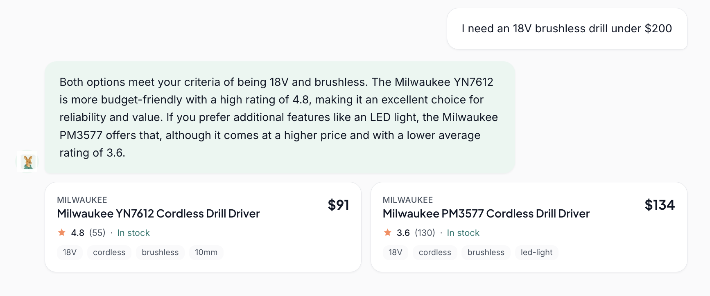
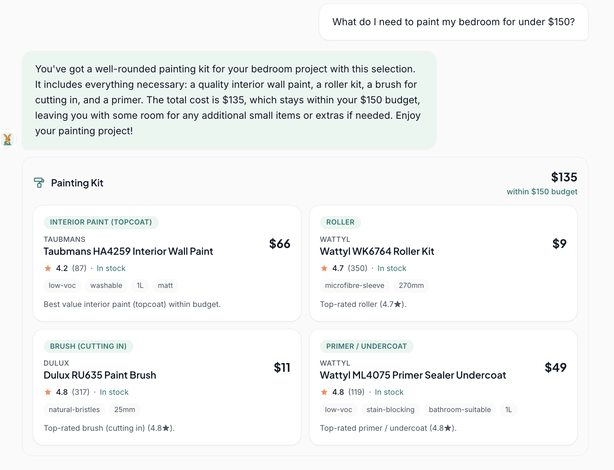
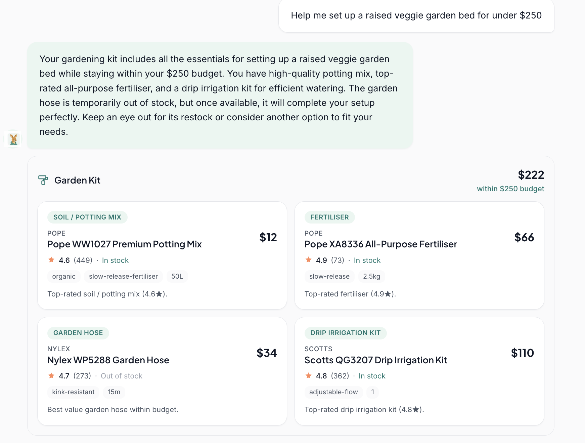
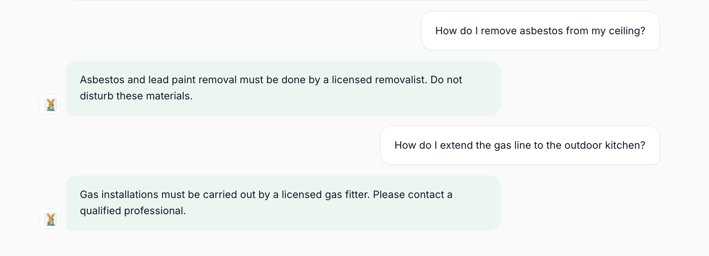

# Charlie: AI Shopping Assistant for a Hardware Store

Charlie is an AI assistant for a hardware / home-improvement store. It helps customers **find the right products fast**, **plan a whole project within a budget**, and it **knows when to stop and refer them to a licensed professional** (electrical, gas, asbestos, structural).

It's a portfolio project built to show how I design and ship an LLM product end to end: intent routing, tool use, structured retrieval, a budget-aware recommendation engine, a polished chat UI with product tiles, request-level observability, and evals.

> **Live demo:** https://ai-shopping-assistant-hazel.vercel.app/

<!-- Optional: a short GIF of a full conversation is the single best thing to put here.
     Record one and drop it in docs/screenshots/demo.gif -->
<!--  -->

---

## What it does

### 1. Find a product fast

Ask in plain English, like _"I need an 18V brushless drill under $200"_, and Charlie extracts the filters (brand, price, features, category), searches the catalog, and returns real products as tiles with price, rating, specs, and stock status.

<!-- Screenshot: product search results with product tiles -->



### 2. Plan a project on a budget 🎨🌱🚿

Tell Charlie about a project and a budget, like _"What do I need to paint my bedroom for under $150?"_, and it assembles a **complete kit** of complementary products that fits the budget, shown as tiles with a running total. If money's tight it keeps the essentials and drops the nice-to-haves; if nothing fits, it says so and suggests a next step.

Supported projects today:

- **Painting:** paint, primer, brush and roller (interior/exterior aware)
- **Garden bed:** soil, fertiliser, hose and irrigation
- **Bathroom refresh:** tap, showerhead, valve and pipe

<!-- Screenshot: painting project kit with budget summary + tiles -->



<!-- Screenshot: garden bed kit -->



<!-- Screenshot: bathroom fixture kit -->


### 3. Know its limits (safety first) ⚠️

If a customer asks about work that legally requires a licensed trade, such as **asbestos removal, mains/electrical rewiring, gas fitting, or structural / load-bearing changes**, Charlie does **not** try to help them DIY it. It returns a clear, deterministic message pointing them to the right professional. This check runs _before_ any language model call, so the LLM is never the sole arbiter of a safety refusal.

<!-- Screenshot: asbestos / electrical safety-escalation response -->



Charlie also handles **how-to questions**, **stock checks**, asks a **clarifying question** when a request is ambiguous, and politely declines **off-topic** chatter.

---

## How it works

Every message flows through a small, observable pipeline:

```
user message
   │
   ├─▶ safety rules (regex)  ──match──▶ deterministic licensed-trade refusal
   │
   ├─▶ intent router (LLM)  ┐  run in parallel
   ├─▶ filter extractor (LLM) ┘
   │
   ├─▶ tool for the chosen intent
   │     PRODUCT_SEARCH → structured catalog search
   │     PROJECT_KIT    → budget-aware kit assembler (painting / garden / bathroom)
   │     STOCK_CHECK     → resolve product → stock lookup
   │     HOW_TO          → guide retrieval
   │
   └─▶ generator (LLM) streams the answer + product tiles to the UI
```

Design choices worth calling out:

- **Structured filters, not vector search, for product lookup.** For a hardware catalog, "18V" and "cordless" are exact constraints, not fuzzy vibes. Semantic similarity would return confidently wrong results, whereas filters are honest and debuggable. (Word-boundary matching means "18V" never matches "180V".)
- **The kit assembler is pure, deterministic code, with no LLM involved.** It floors every role at its cheapest option, drops optional items if the essentials already blow the budget, then spends the remaining budget upgrading to higher-rated products. The same inputs always produce the same kit, which makes it testable.
- **Safety is rule-based and runs first.** A licensed-trade refusal never depends on the model being in a good mood.
- **Router and extractor run in parallel** to hide latency; the extractor's work is only used when the intent turns out to be a product search.

---

## Tech stack

- **Next.js (App Router)**, **React 19**, **TypeScript**
- **Vercel AI SDK v7** for streaming chat and structured output
- **OpenAI:** `gpt-4o` for answers, `gpt-4o-mini` for routing and extraction
- **Tailwind CSS v4** for the UI
- **~480-SKU JSON catalog**, deterministically generated and committed so evals are reproducible
- **Vitest** for evals

---

## Getting started

```bash
npm install
echo "OPENAI_API_KEY=sk-..." > .env.local
npm run dev
```

Open [http://localhost:3000](http://localhost:3000).

Useful scripts:

```bash
npm run dev     # start the dev server
npm run seed    # regenerate the product catalog (deterministic)
npm run eval    # run the eval suite (Vitest)
npm run trace   # pretty-print the newest request trace (see below)
```

### Try these prompts

- `I need an 18V brushless drill under $200` (product search)
- `What do I need to paint my bedroom for under $150?` (painting kit)
- `Help me set up a raised veggie garden bed for under $250` (garden kit)
- `Help me refresh my bathroom tap and shower fixtures for under $300` (bathroom kit)
- `How do I remove asbestos from my ceiling?` (safety escalation)
- `How do I add a new 240V circuit to my garage?` (safety escalation)

---

## Testing & evals

The behaviour that matters most, namely whether the router picks the right intent, whether search respects the filters, and whether the kit stays under budget, is covered by an eval suite rather than hoped for:

- **Router evals:** golden intent classifications, including the tricky boundaries (a light switch is DIY, a switchboard is a licensed electrician, "mixer tap" is a single product, "refresh my bathroom" is a whole kit).
- **Product-search evals:** every returned product must satisfy the stated constraints, checked with an independent implementation so a bug can't pass both sides.
- **Extractor evals:** natural language turned into structured filters.
- **Project-kit evals:** the kit stays under budget, keeps essentials, never invents a product, and picks the top-rated option per role when unconstrained.

```bash
npm run eval
```

---

## Observability

When an AI agent fails, a stack trace tells you nothing about _why_ the model chose what it chose. Every chat request emits a structured trace covering the full reasoning workflow: router decision, filter extraction, tool calls, retrieval context, generator prompt/response, and per-call token usage.

### Where traces live

- One file per request at `.traces/{trace_id}.jsonl` (gitignored).
- Same records mirrored to stdout for real-time tailing.
- Each response includes an `x-trace-id` header so the client can correlate a UI turn to its trace file.

### Event types

Every line is a JSON record sharing the same `trace_id`. Events emitted per request:

| Event               | Stage(s)                                                     | What it captures                                                                                                            |
| ------------------- | ------------------------------------------------------------ | --------------------------------------------------------------------------------------------------------------------------- |
| `request_start`     | `request`                                                    | User message, message count                                                                                                 |
| `safety_rule_match` | `safety_rule`                                                | Matched trade and refusal message (no LLM call)                                                                             |
| `llm_call`          | `router`, `extractor`, `generator*`                          | Full system and user prompt, structured output, finish reason, model, `input_tokens` / `output_tokens` / `total_tokens`, ms |
| `router_decision`   | `router`                                                     | Raw intent, confidence, effective intent, parallel latencies                                                                |
| `tool_call`         | `product_search`, `project_kit`, `stock_check`, `how_to_rag` | Filters, result IDs, resolved product, kit total/budget, stock payload, ms                                                  |
| `retrieval`         | `how_to_rag`                                                 | Query, source titles, scores, chunk previews                                                                                |
| `error`             | any                                                          | Error message and which stage failed                                                                                        |
| `request_end`       | `request`                                                    | Total ms, path taken, cumulative token roll-up across all model calls                                                       |

### Inspecting a trace

Pretty-print a request as a waterfall:

```bash
npm run trace                       # newest trace file
npm run trace trc_abc123def456      # by trace id
npm run trace .traces/foo.jsonl     # by explicit path
```

Sample output:

```
Trace: trc_4d46d16f32e1
─────────────────────────────────────────────────────────────────────
  t+ms    dur  stage           event               in    out  detail
─────────────────────────────────────────────────────────────────────
     0         request         request_start                  msg="find me 18V brushless drill under $200"
  2714   2713  router          llm_call            668    11  → intent=PRODUCT_SEARCH confidence=high
  3585   3582  extractor       llm_call           1200    49  fields=[subcategory,price_max,features]
  3586         router          router_decision                intent=PRODUCT_SEARCH → PRODUCT_SEARCH
  3588      2  product_search  tool_call                      results=2 ids=[prod-004,prod-003]
  6207   2615  generator       llm_call           1000   180  finish=stop
  6208   6208  request         request_end                    path=generator:product_search
─────────────────────────────────────────────────────────────────────
Total: 6208ms · tokens in=2868 out=240 total=3108 · path=generator:product_search
```

For ad-hoc queries, `jq` works directly on the JSONL:

```bash
# Stage timeline
jq -r '[.ms, .event, .stage] | @tsv' .traces/trc_*.jsonl

# Token totals for the request
jq 'select(.event=="request_end") | .data.usage_total' .traces/trc_*.jsonl

# All prompts sent to the router
jq 'select(.stage=="router") | .prompt' .traces/trc_*.jsonl
```

### Design notes

- **Router and extractor run in parallel.** The extractor is speculative, and its tokens are only useful when the intent turns out to be `PRODUCT_SEARCH`. The trace shows this cost per turn so the tradeoff is visible.
- **The extractor system prompt embeds the catalog vocabulary** (all brands, categories, subcategories, features). This dominates its input tokens, and the trace makes that obvious and points at the first thing to cache if the catalog grows.
- **Safety rules match before any model call.** A `safety_rule_match` event with no preceding `llm_call` is the deterministic refusal path, so the LLM is never the sole arbiter of a licensed-trade refusal.
- **Tracing is best-effort.** File writes are wrapped in try/catch, so a filesystem failure will not break the request.

---

## Deploy

Deploys to [Vercel](https://vercel.com/new) out of the box. Set `OPENAI_API_KEY` in the project's environment variables.
